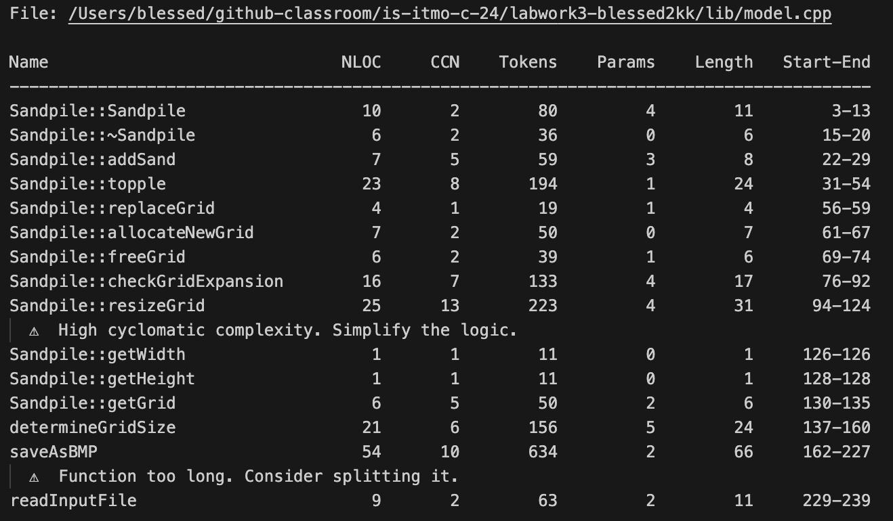
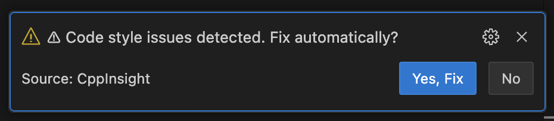
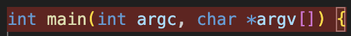
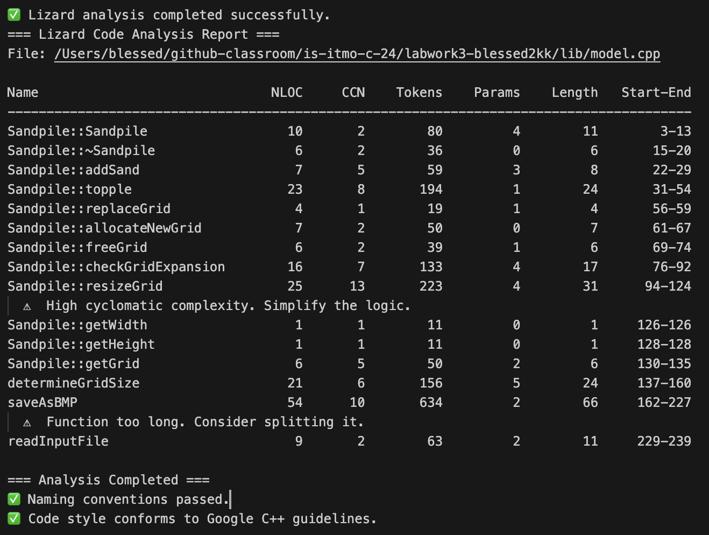

# CppInsight

**CppInsight** – это расширение для Visual Studio Code, предназначенное для анализа C++ кода с помощью **Lizard** и **clang-format**. Оно помогает разработчикам поддерживать качество кода, выявлять проблемы стиля и сложности.

## 📋 Features

- **Анализ метрик кода**: Использует [Lizard](https://github.com/terryyin/lizard) для расчета метрик:
  - NLOC (количество строк кода),
  - Cyclomatic Complexity (цикломатическая сложность),
  - Количество параметров функций,
  - Количество токенов.
- **Проверка на соответствие Google C++ Style Guide**: Интеграция с **clang-format** для автоматической проверки и исправления проблем стиля.
- **Проверка именования переменных и функций**: Поддержка стилей `snake_case` и `camelCase` с исключениями для встроенных функций и типов данных.
- **Подсветка проблем**: Подсветка кода с проблемами стиля или метрик.
- **Очистка Output-панели**: Очистка панели перед новым анализом для лучшего восприятия.

---

## 🟎️ Screenshots

1. **Анализ кода на метрики**  
   

2. **Автоматическое исправление стиля**  
   

3. **Подсветка функции с проблемной метрикой**  
   

---

## ⚙️ Requirements

1. Установленный **Lizard**:  
   ```bash
   pip install lizard
   ```

2. Установленный **clang-format** (для проверки и исправления стиля кода):  
   - Убедитесь, что **clang-format** доступен в `PATH`.

3. Visual Studio Code версии **1.60.0** или новее.

---

## 🛠️ Extension Settings

**CppInsight** добавляет следующие настройки:

- `cppinsight.enableAnalysisOnSave` *(boolean)*:  
   Автоматически запускать анализ при сохранении файла.  
   **Default**: `true`.

- `cppinsight.styleFixPrompt` *(boolean)*:  
   Показывать диалоговое окно для исправления стиля автоматически.  
   **Default**: `true`.

- `cppinsight.highlightIssues` *(boolean)*:  
   Включить подсветку проблем в коде.  
   **Default**: `true`.

---

## 🚀 Usage

### Анализ файла C++

1. Откройте C++ файл в Visual Studio Code.
2. При сохранении файла (`Ctrl+S` или `Cmd+S`) будет автоматически запущен анализ:
   - Метрики кода с помощью **Lizard**.
   - Проверка стиля с помощью **clang-format**.
   - Проверка именования переменных и функций.
3. Результаты анализа отображаются в **Output** панели:  
   

### Исправление стиля вручную

1. Если были обнаружены проблемы стиля, в Output-панели будет предложено автоматически исправить стиль.
Нажмите "Yes, Fix" в диалоговом окне.
2. clang-format применит исправления в соответствии с Google C++ Style Guide.

## 🔍 Known Issues

-  Lizard может выдавать предупреждения для больших файлов.
   Решение: Разделите крупные файлы на более мелкие модули.
-  Некорректные результаты именования в строковых литералах.
   Решение: Обновите расширение до последней версии.
Если возникли другие проблемы, сообщите о них на странице [Issues](https://github.com/your-repo-name/issues).

## 🗒️ Release Notes

1.0.0
-  Добавлена интеграция Lizard для анализа метрик кода.
-  Встроенная поддержка clang-format для проверки и исправления стиля кода.
-  Проверка соответствия именования переменных и функций (snake_case и camelCase).
-  Автоматический анализ при сохранении файлов.
-  Подсветка проблем и вывод отчетов в Output-панели.

## 📚 Following Extension Guidelines

Данное расширение разработано с соблюдением рекомендаций для расширений Visual Studio Code.

Подробнее:

-  [Extension Guidelines](https://code.visualstudio.com/api/references/extension-guidelines)

## 💡 For More Information

-  [Lizard](https://github.com/terryyin/lizard): Анализ метрик кода.
-  [Google C++ Style Guide](https://google.github.io/styleguide/cppguide.html): Руководство по стилю кода.
-  [clang-format Documentation](https://clang.llvm.org/docs/ClangFormatStyleOptions.html): Форматирование кода с использованием clang-format.

**Enjoy Coding with CppInsight! 🚀**